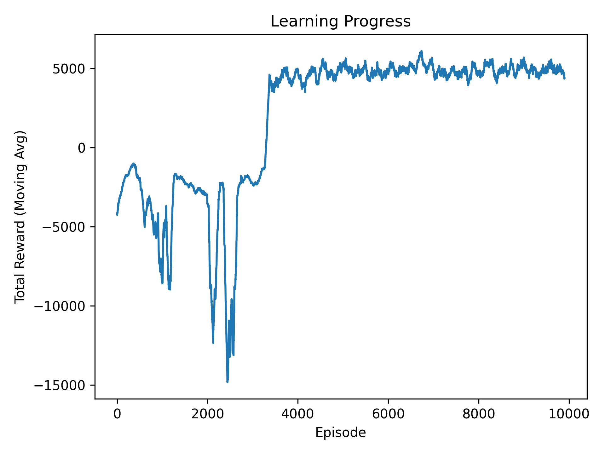

# AI Track Solver with Q-Learning

## Index

1. [Description](#description)
2. [How It Works](#how-it-works)
3. [Output](#output)
4. [Installation](#installation)
5. [Usage](#usage)
    - [Drawing a Track](#drawing-a-track)
        - [Controls](#controls)
            - [Colors](#colors)
    - [Training the AI](#training-the-ai)
6. [Configuration](#configuration)
7. [Project Structure](#project-structure)


## Description

This AI can train a car to complete a custom track drawn by the user and find the shortest path possible. The AI is made from scratch using custom classes and utilizes a Q-Learning Agent for training.


## How It Works

- `draw_track.py`: Allows you to create a custom track using Pygame.
- `train.py`: Trains a Q-Learning Agent to find the optimal path to reach the finish on your custom track.


## Output

* **Learning curve:** Graph of the learning curve
* **Best attempt:** Video of the best attempt.
* **GIFs**: GIFs of the best attempts; of each time the max reward is surpassed
* **Combined attempts**: Video of the combined attempts.

### Example Output

#### Learning Curve



*Graph depicting the AI's learning trajectory over training sessions.*


#### Best Attempt Video

https://github.com/carlospuenteg/Q-Racer/assets/65092569/43b7d978-d46d-4c2d-95b3-30c176a2f7bb

*Footage of the AI's optimal path completion.*


#### Combined Attempts Video

https://github.com/carlospuenteg/Q-Racer/assets/65092569/be02317c-7827-4e14-aa6a-32aa4cfac694

*Montage video showing a range of attempts, visualizing the AI's evolution.*


#### GIFs of Milestones


*GIFs capturing breakthrough moments when the AI outperformed its previous best (these are just some of them).*


## Installation

1. Clone the repository:
    ```bash
    git clone <repository_link>
    ```
2. Install required packages:
    ```bash
    pip install -r requirements.txt
    ```


## Usage

### Drawing a Track

Run `draw_track.py` to create your own track:

```bash
python3 draw_track.py
```


#### Controls:

##### Colors

- Options
  - <kbd>⌃ Control</kbd> + <kbd>S</kbd> Save track.
  - <kbd>⌃ Control</kbd> + <kbd>Z</kbd> Undo.
- Bucket fill (<kbd>⇧ Shift</kbd>) + **COLOR** + <kbd>Left Click</kbd>
  - <kbd>B</kbd> Background color.
  - <kbd>R</kbd> Road color.
  - <kbd>O</kbd> Obstacle/border color.
  - <kbd>S</kbd> Start color.
  - <kbd>F</kbd> Finish color.


### Training the AI

After drawing your track, run `train.py`:

```bash
python3 train.py
```

This initiates the training loop and generates videos and graphs of the training process. The training process can be configured in the `conf` directory.


## Configuration

Customize various settings in the `conf` directory:
- [`conf.general.py`](conf/general.py): General settings.
- [`conf/track.py`](conf/track.py): Track settings.
- [`conf/agent.py`](conf/agent.py): Agent settings (Q-Learning).


## Project Structure

- `classes/`:
  - [`TrackEnv.py`](classes/TrackEnv.py): Custom environment for the track.
  - [`QLearningAgent.py`](classes/QLearningAgent.py): Q-Learning Agent.
- `constants/`: Constant values and paths.
  - [`general.py`](constants/general.py): General, agent and track constants.
  - [`paths.py`](constants/paths.py): Path constants.
- `conf/`: Configuration settings.
  - [`general.py`](conf/general.py): General settings.
  - [`track.py`](conf/track.py): Track settings.
  - [`agent.py`](conf/agent.py): Agent settings (Q-Learning).
- `utils/`: Utility functions like plotting.
  - [`images.py`](utils/images.py): Image-related functions.
  - [`plot.py`](utils/plot.py): Plotting functions.
- `track/`: Stores the custom track.
  - `track.npy`: Numpy array of the track.
- `out/`: Stores the learning curve PNG image after training.
  - `learning_curve.png`: Learning curve PNG image.
  - `best_attempt.mp4`: Video of the best attempt.
  - `combined_attempts.mp4`: Video of the combined attempts.
  - `attempts/`: Folder containing GIFs of the best attempts; of each time the max reward is surpassed.
- [`train.py`](train.py): Trains a Q-Learning Agent to find the optimal path to reach the finish on your custom track.
- [`draw_track.py`](draw_track.py): Allows you to create a custom track using Pygame.
- [`requirements.txt`](requirements.txt): Required packages.
- [`LICENSE.md`](LICENSE.md): MIT License.
